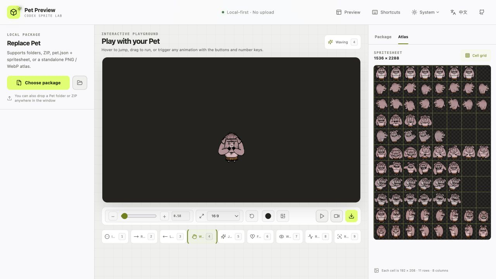

# Codex Pet Preview

English | [简体中文](README.zh-CN.md)

A local-first previewer for Codex Pet packages. It runs entirely in your browser, never uploads files, and requires no backend.

## Screenshots

### Desktop

| English | Simplified Chinese |
| --- | --- |
|  |  |

### Responsive layout

<p align="center">
  
</p>

### Playground

<p align="center">
  
</p>

## Features

- Load a Pet folder, ZIP, `pet.json` plus spritesheet, or a standalone PNG / WebP atlas
- Support both legacy 8×9 atlases and v2 8×11 atlases
- Play all nine standard animations using the per-frame timing defined by Codex
- Play, pause, step through frames, change speed, loop, scale, and toggle pixel rendering
- Debug the v2 pointer-driven Look mode with 16 directions at 22.5° intervals, a configurable deadzone, live angle data, and cell coordinates
- Inspect the full atlas with a 192×208 cell grid
- Diagnose dimensions, version declarations, required cells, and transparency in unused cells directly in the browser
- Preview against dark, light, checkerboard, and chroma backgrounds with centerline and baseline guides
- Use the interactive Playground to hover-jump, drag-run, resize, and trigger every Pet animation with UI controls or number keys
- Play every animation in order and export the canvas as a browser-recorded video or an encoded GIF, including transparent WebM/GIF output and automatic download when encoding finishes
- Select from 24 presets or enter HEX/RGB backgrounds in a compact color popover, use a transparent grid, or crop a local PNG, JPEG, or WebP image
- Resize the canvas with common aspect-ratio presets or custom dimensions; presets preserve the current height and adjust the width
- Start at Codex's 112 px Pet width and retain crisp small-scale previews with a high-DPI canvas
- Switch the full interface between light and dark themes, or automatically follow the operating system
- Switch the complete interface between English and Simplified Chinese

## Playground

Open **Playground** after loading a Pet package to test the character in a canvas that behaves like the Codex Pet runtime.

### Interact with the Pet

- Hover over the Pet to trigger Jump, then drag it left or right to trigger the matching Run animation. Releasing the pointer returns it directly to Idle.
- Trigger all nine animations with the on-screen buttons or the `1`–`9` keys, including animations that do not have a pointer gesture.
- Resize the Pet from `0.5×` to `4×`. The initial and reset size matches Codex's default 112 px rendering width, while the high-DPI canvas keeps smaller previews crisp.
- Use **Reset position and size** to return the Pet to its default placement and scale.

### Build the scene

- Choose `16:9`, `4:3`, `3:2`, `1:1`, or `9:16`, or enter a custom canvas size. Ratio presets keep the current height and adjust the width.
- Pick from 24 background presets, enter a HEX value, edit the R/G/B channels, or select the transparent checkerboard option.
- Add a local PNG, JPEG, or WebP background and adjust its zoom and focal position with the crop controls.

### Play and export

- **Play all** presents every animation in sequence without placing progress overlays over the canvas.
- **Export video** records the complete sequence with `MediaRecorder`; **Export GIF** encodes it in the browser. The finished file downloads automatically.
- Transparent backgrounds remain transparent in GIF output and in alpha-capable WebM recording. Video codec support depends on the browser.

## Getting started

Node.js 20.19 or later is required.

```bash
npm install
npm run dev
```

Open the local URL printed by the terminal, usually <http://localhost:5173>.

For a production build:

```bash
npm run build
npm run preview
```

## Supported package formats

Standard directory structure:

```text
my-pet/
├── pet.json
└── spritesheet.webp
```

Example `pet.json`:

```json
{
  "id": "my-pet",
  "displayName": "My Pet",
  "description": "A tiny local pet.",
  "spriteVersionNumber": 2,
  "spritesheetPath": "spritesheet.webp"
}
```

Legacy atlases are `1536×1872` (8 columns × 9 rows). V2 atlases are `1536×2288` (8 columns × 11 rows) and must declare `spriteVersionNumber: 2`.

Each cell is fixed at `192×208`. V2 Look rows use this order:

```text
row 9:  000, 022.5, 045, 067.5, 090, 112.5, 135, 157.5
row 10: 180, 202.5, 225, 247.5, 270, 292.5, 315, 337.5
```

`000` points up on screen and `090` points right. The preview returns to Idle when the pointer enters the deadzone.

## Keyboard shortcuts

| Key | Action |
| --- | --- |
| `1`–`9` | Switch standard animation |
| `Space` | Play / pause |
| `←` / `→` | Previous / next frame |
| `L` | Toggle v2 Look mode |
| `G` | Toggle guides |

## Privacy and browser compatibility

Files are parsed through the File API, Canvas, and local object URLs. They never leave the current browser tab. ZIP files are extracted in memory with `fflate`.

Standard file selection works in modern browsers. Folder selection and dropping folders directly into the app work best in Chromium-based browsers. Safari and Firefox users can load a ZIP or select `pet.json` and the spritesheet together.

## Development commands

```bash
npm run lint
npm run build
```
