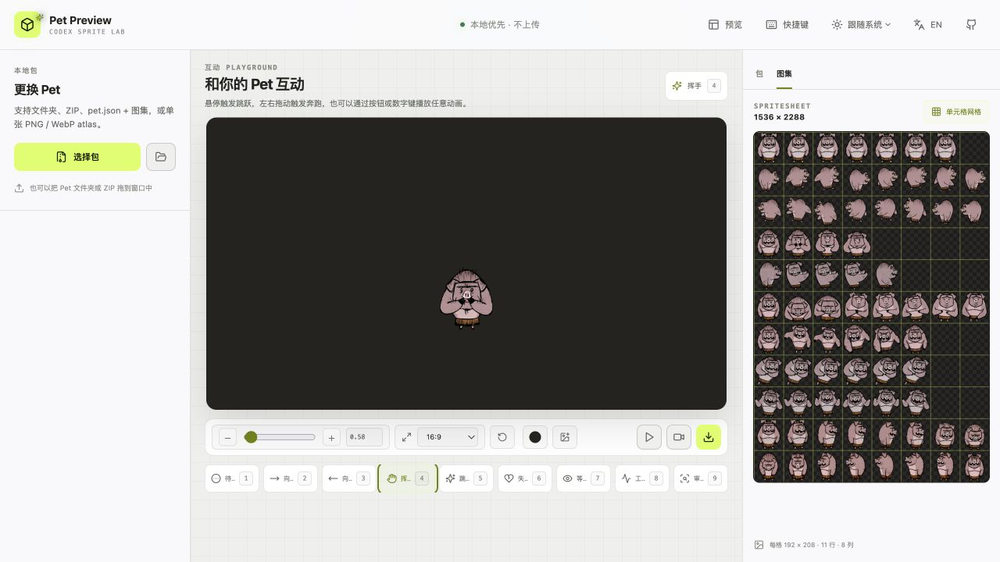

# Codex Pet Preview

[English](README.md) | 简体中文

一个 local-first 的 Codex Pet 包预览器。它完全运行在浏览器中，不上传文件，也不需要后端。

## 截图

### 桌面端

| 英文界面 | 简体中文界面 |
| --- | --- |
|  |  |

### 响应式布局

<p align="center">
  
</p>

### Playground

<p align="center">
  
</p>

## 功能

- 加载 Pet 文件夹、ZIP、`pet.json` + spritesheet，或单张 PNG / WebP atlas
- 同时兼容旧版 8×9 atlas 和 v2 8×11 atlas
- 按 Codex 约定的逐帧时长播放 9 个标准动画
- 播放 / 暂停、逐帧、变速、循环、缩放与像素渲染
- v2 光标 Look 模式：16 个 22.5° 方向、deadzone、实时角度与 cell 定位
- Atlas 全图和 192×208 cell 网格检查
- 浏览器内结构诊断：尺寸、版本声明、必需 cell、未使用 cell 透明度
- 深色、浅色、棋盘格和 chroma 背景，附带中心线与基线辅助线
- Playground 支持悬停跳跃、拖动奔跑、缩放 Pet，并可通过 UI 按钮或数字键触发全部动画
- 按顺序播放全部动画，并导出浏览器录制的视频或编码后的 GIF，支持透明 WebM / GIF；编码完成后自动下载
- Playground 背景颜色收纳在紧凑 popover 中，支持 24 个预设颜色、自定义 HEX / RGB、透明网格，以及裁剪本地 PNG、JPEG、WebP 图片
- 画布支持常用长宽比预设与自定义尺寸；切换预设时保持当前高度，仅调整宽度
- 默认使用 Codex 的 112 px Pet 宽度，并通过高 DPI 画布保持小尺寸预览清晰
- 完整界面支持深色、浅色主题切换，也可自动跟随操作系统
- 完整界面支持英文与简体中文切换

## Playground

载入 Pet 包后打开 **Playground**，即可在接近 Codex Pet 实际运行方式的画布中测试角色。

### 与 Pet 互动

- 鼠标悬停 Pet 时触发跳跃，向左或向右拖动时播放对应奔跑动画；松开后直接回到待机动画。
- 通过界面按钮或数字键 `1`–`9` 触发全部 9 个动画，包括无法用鼠标手势触发的动画。
- Pet 支持 `0.5×`–`4×` 缩放；初始和重置尺寸与 Codex 默认的 112 px 渲染宽度一致，高 DPI 画布可保持小尺寸预览清晰。
- 点击 **重置位置和大小** 可同时恢复默认位置与缩放。

### 设置画面

- 支持 `16:9`、`4:3`、`3:2`、`1:1`、`9:16` 预设与自定义画布尺寸；切换比例时保持当前高度，仅调整宽度。
- 可从 24 个背景预设中选择颜色，也可输入 HEX、分别编辑 R/G/B 通道，或使用透明网格。
- 支持添加本地 PNG、JPEG、WebP 背景图片，并通过裁剪控件调整缩放和焦点位置。

### 播放与导出

- **顺序播放** 会依次展示全部动画，不会使用进度蒙层遮挡画布。
- **导出视频** 使用浏览器 `MediaRecorder` 录制完整序列，**导出 GIF** 在浏览器内编码；完成后会立即自动下载。
- 透明背景会保留在 GIF 和支持 Alpha 的 WebM 视频中；实际视频编码能力取决于浏览器。

## 启动

需要 Node.js 20.19+。

```bash
npm install
npm run dev
```

然后打开终端输出的本地地址，通常是 <http://localhost:5173>。

生产构建：

```bash
npm run build
npm run preview
```

## 支持的包格式

标准目录结构：

```text
my-pet/
├── pet.json
└── spritesheet.webp
```

`pet.json` 示例：

```json
{
  "id": "my-pet",
  "displayName": "My Pet",
  "description": "A tiny local pet.",
  "spriteVersionNumber": 2,
  "spritesheetPath": "spritesheet.webp"
}
```

旧版 atlas 为 `1536×1872`（8 列 × 9 行）。v2 atlas 为 `1536×2288`（8 列 × 11 行），必须声明 `spriteVersionNumber: 2`。

每个 cell 固定为 `192×208`。v2 的 Look rows 顺序如下：

```text
row 9:  000, 022.5, 045, 067.5, 090, 112.5, 135, 157.5
row 10: 180, 202.5, 225, 247.5, 270, 292.5, 315, 337.5
```

`000` 表示屏幕向上，`090` 表示屏幕向右。光标进入 deadzone 时回到 Idle。

## 快捷键

| 按键 | 动作 |
| --- | --- |
| `1`–`9` | 切换标准动画 |
| `Space` | 播放 / 暂停 |
| `←` / `→` | 上一帧 / 下一帧 |
| `L` | 切换 v2 Look 模式 |
| `G` | 切换辅助线 |

## 隐私与浏览器兼容

文件通过 File API、Canvas 和本地 Object URL 解析，不会离开当前浏览器标签。ZIP 由 `fflate` 在内存中解压。

常规文件选择适用于现代浏览器。文件夹选择和直接拖入文件夹建议使用 Chromium 系浏览器；Safari / Firefox 可以改用 ZIP 或同时选择 `pet.json` 与 spritesheet。

## 开发命令

```bash
npm run lint
npm run build
```
